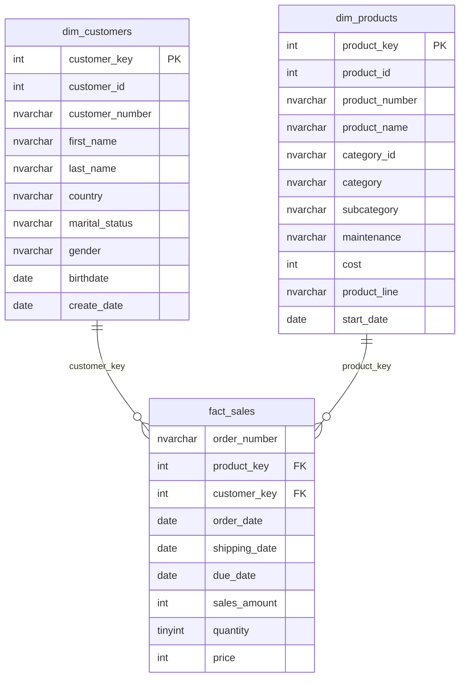

# 🏢 Data Warehouse Analytics Project

> **A comprehensive SQL data analytics project demonstrating advanced data warehouse concepts, exploratory data analysis (EDA), and business intelligence reporting.**

[](https://www.microsoft.com/en-us/sql-server)
[](https://github.com)
[](https://github.com)

## 📋 Table of Contents

- [Project Overview](#-project-overview)
- [Database Schema](#-database-schema)
- [Analytics Framework](#-analytics-framework)
- [Key Features](#-key-features)
- [Sample Queries & KPIs](#-sample-queries--kpis)
- [Usage Examples](#-usage-examples)
- [Business Reports](#-business-reports)
- [Contributing](#-contributing)

## 🎯 Project Overview

This project implements a complete data warehouse solution for sales analytics, featuring:

- **Star Schema Design** with dimension and fact tables
- **12-Step Analytics Framework** covering EDA to advanced reporting
- **Customer & Product Intelligence** with segmentation analysis
- **Time-Series Analytics** with trends and cumulative metrics
- **Performance Dashboards** with KPI calculations

### Business Context
The data warehouse contains sales transaction data with customer demographics and product information, enabling comprehensive business intelligence analysis for strategic decision-making.

## 🗂️ Database Schema

### Star Schema Architecture



### Table Descriptions

| Table | Type | Description | Key Metrics |
|-------|------|-------------|-------------|
| `dim_customers` | Dimension | Customer master data with demographics | 🔑 Customer segmentation, age groups |
| `dim_products` | Dimension | Product catalog with categories and costs | 🔑 Product performance, cost analysis |
| `fact_sales` | Fact | Sales transactions with quantities and amounts | 🔑 Revenue, orders, quantities |

## 📊 Analytics Framework

This project follows a structured 12-step analytics approach:

### 🔍 Exploratory Data Analysis (EDA)
1. **Database Exploration** - Schema analysis and data profiling
2. **Dimensions Exploration** - Customer and product analysis
3. **Date Exploration** - Temporal data patterns
4. **Measures Exploration** - Sales metrics and distributions
5. **Magnitude Analysis** - Big numbers and scale assessment
6. **Ranking Analysis** - Top/bottom performers

### 📈 Advanced Analytics
7. **Change-Over-Time** - Trend analysis and seasonality
8. **Cumulative Analysis** - Running totals and moving averages
9. **Performance Analysis** - Year-over-year comparisons
10. **Part-to-Whole** - Proportional analysis and contributions
11. **Data Segmentation** - Customer and product segmentation
12. **Business Reporting** - Comprehensive dashboards

## ✨ Key Features

### 🎯 Customer Analytics
- **Customer Segmentation**: VIP, Regular, and New customer classification
- **Age Group Analysis**: Demographic-based insights
- **Lifetime Value**: Customer spending patterns and loyalty metrics
- **Recency Analysis**: Last purchase behavior tracking

### 📦 Product Analytics
- **Performance Segmentation**: High, Mid, and Low performers
- **Category Analysis**: Revenue contribution by product categories
- **Cost-Revenue Analysis**: Profitability insights
- **Product Lifecycle**: Sales trends and product longevity

### 📅 Time-Series Analytics
- **Trend Analysis**: Monthly, yearly sales patterns  
- **Cumulative Metrics**: Running totals and growth tracking
- **Moving Averages**: Smoothed trend analysis
- **Seasonal Patterns**: Peak and trough identification

## 📈 Sample Queries & KPIs

### 🏆 Top KPIs Dashboard

```sql
-- Key Performance Indicators
SELECT 
    COUNT(DISTINCT customer_key) as Total_Customers,
    COUNT(DISTINCT order_number) as Total_Orders,
    SUM(sales_amount) as Total_Revenue,
    SUM(quantity) as Total_Units_Sold,
    AVG(sales_amount) as Avg_Order_Value
FROM gold.fact_sales
WHERE order_date >= '2023-01-01'
```

**Sample Output:**
| Total_Customers | Total_Orders | Total_Revenue | Total_Units_Sold | Avg_Order_Value |
|----------------|--------------|---------------|------------------|-----------------|
| 2,847 | 15,432 | $12,847,293 | 89,234 | $832.45 |

### 📊 Monthly Sales Trend

```sql
-- Monthly Sales Performance
SELECT
    FORMAT(order_date, 'yyyy-MMM') as Order_Month,
    SUM(sales_amount) as Monthly_Sales,
    COUNT(DISTINCT customer_key) as Active_Customers,
    SUM(quantity) as Units_Sold
FROM gold.fact_sales
WHERE order_date IS NOT NULL
GROUP BY FORMAT(order_date, 'yyyy-MMM')
ORDER BY FORMAT(order_date, 'yyyy-MMM')
```

**Sample Output:**
| Order_Month | Monthly_Sales | Active_Customers | Units_Sold |
|-------------|---------------|------------------|------------|
| 2023-Jan | $1,245,678 | 456 | 3,421 |
| 2023-Feb | $1,398,234 | 523 | 3,892 |
| 2023-Mar | $1,567,890 | 601 | 4,234 |

### 🎯 Customer Segmentation Analysis

```sql
-- Customer Segmentation with Key Metrics
WITH customer_metrics AS (
    SELECT 
        customer_key,
        SUM(sales_amount) as Total_Spending,
        COUNT(DISTINCT order_number) as Total_Orders,
        DATEDIFF(month, MIN(order_date), MAX(order_date)) as Lifespan,
        DATEDIFF(month, MAX(order_date), GETDATE()) as Recency
    FROM gold.fact_sales
    GROUP BY customer_key
)
SELECT 
    CASE 
        WHEN Lifespan >= 12 AND Total_Spending > 5000 THEN 'VIP'
        WHEN Lifespan >= 12 AND Total_Spending <= 5000 THEN 'Regular'
        ELSE 'New'
    END as Customer_Segment,
    COUNT(*) as Customer_Count,
    AVG(Total_Spending) as Avg_Spending,
    AVG(Total_Orders) as Avg_Orders,
    AVG(Recency) as Avg_Recency_Months
FROM customer_metrics
GROUP BY CASE 
    WHEN Lifespan >= 12 AND Total_Spending > 5000 THEN 'VIP'
    WHEN Lifespan >= 12 AND Total_Spending <= 5000 THEN 'Regular'
    ELSE 'New'
END
```

**Sample Output:**
| Customer_Segment | Customer_Count | Avg_Spending | Avg_Orders | Avg_Recency_Months |
|------------------|----------------|--------------|------------|-------------------|
| VIP | 234 | $8,942.15 | 23.4 | 2.1 |
| Regular | 1,456 | $2,341.78 | 8.7 | 3.8 |
| New | 1,157 | $456.32 | 2.1 | 1.2 |

### 🏅 Top Performing Products

```sql
-- Product Performance Analysis
SELECT TOP 10
    p.product_name,
    p.category,
    SUM(f.sales_amount) as Total_Revenue,
    SUM(f.quantity) as Units_Sold,
    COUNT(DISTINCT f.customer_key) as Unique_Customers,
    AVG(f.price) as Avg_Selling_Price
FROM gold.fact_sales f
JOIN gold.dim_products p ON f.product_key = p.product_key
GROUP BY p.product_name, p.category
ORDER BY Total_Revenue DESC
```

**Sample Output:**
| Product_Name | Category | Total_Revenue | Units_Sold | Unique_Customers | Avg_Selling_Price |
|--------------|----------|---------------|------------|------------------|-------------------|
| Mountain Bike Pro | Bikes | $892,456 | 234 | 198 | $3,814.77 |
| Road Bike Elite | Bikes | $745,123 | 187 | 165 | $3,984.89 |
| Touring Bike Standard | Bikes | $634,789 | 156 | 134 | $4,069.16 |

## 💡 Usage Examples

### Basic Analytics Queries

```sql
-- 1. Sales by Year
SELECT 
    YEAR(order_date) as Sales_Year,
    SUM(sales_amount) as Annual_Sales,
    COUNT(DISTINCT customer_key) as Active_Customers
FROM gold.fact_sales 
GROUP BY YEAR(order_date)
ORDER BY Sales_Year;

-- 2. Category Performance
SELECT 
    p.category,
    SUM(f.sales_amount) as Category_Revenue,
    ROUND(SUM(f.sales_amount) * 100.0 / 
        (SELECT SUM(sales_amount) FROM gold.fact_sales), 2) as Revenue_Percentage
FROM gold.fact_sales f
JOIN gold.dim_products p ON f.product_key = p.product_key
GROUP BY p.category
ORDER BY Category_Revenue DESC;
```

### Advanced Window Functions

```sql
-- Running Total and Moving Average
SELECT 
    order_date,
    daily_sales,
    SUM(daily_sales) OVER (ORDER BY order_date) as Running_Total,
    AVG(daily_sales) OVER (ORDER BY order_date ROWS BETWEEN 6 PRECEDING AND CURRENT ROW) as Seven_Day_Avg
FROM (
    SELECT 
        CAST(order_date AS DATE) as order_date,
        SUM(sales_amount) as daily_sales
    FROM gold.fact_sales
    WHERE order_date IS NOT NULL
    GROUP BY CAST(order_date AS DATE)
) daily_totals
ORDER BY order_date;
```

## 📑 Business Reports

### 👥 Customer Intelligence Report
- Customer segmentation with VIP/Regular/New classification
- Age group analysis and demographic insights
- Customer lifetime value and recency metrics
- Purchase behavior patterns

### 📦 Product Performance Report  
- Product segmentation by revenue performance
- Category and subcategory analysis
- Cost vs. revenue profitability analysis
- Product lifecycle and sales trends

### 📈 Executive Dashboard
- Key performance indicators (KPIs)
- Monthly and yearly trend analysis
- Top/bottom performers identification
- Growth metrics and forecasting insights

## 🎯 Key Learning Outcomes

- ✅ **Data Warehouse Design**: Star schema implementation
- ✅ **Advanced SQL**: Window functions, CTEs, complex joins
- ✅ **Business Intelligence**: KPI development and reporting
- ✅ **Data Segmentation**: Customer and product classification
- ✅ **Time-Series Analysis**: Trends and seasonal patterns
- ✅ **Performance Analysis**: Year-over-year comparisons

## 🤝 Contributing

Contributions are welcome! Please feel free to submit a Pull Request. For major changes, please open an issue first to discuss what you would like to change.

## 📄 License

This project is licensed under the MIT License - see the [LICENSE](LICENSE) file for details.

## 📌 Author

**Nishant Kumar Sharma**  
📍 Gautam Buddha Nagar, UP
📧 [nishantksh.277@gmail.com](mailto:nishantksh.277@gmail.com)  
🌐 [GitHub Profile](https://github.com/Nishantksh277)

---

⭐ **Star this repository if you found it helpful!** ⭐

*Built with ❤️ for the data analytics community*
