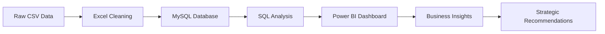

# 📊 Customer Churn Analysis Dashboard

**End-to-End Business Intelligence Solution for Telecom Customer Retention**

*Transforming Raw Data into Actionable Business Insights*

---

## 🎯 Project Overview

An comprehensive data analysis project that leverages the power of **SQL**, **Excel**, and **Power BI** to unlock critical insights about customer churn in the telecommunications industry. This project demonstrates a complete business intelligence pipeline from data extraction to executive-ready dashboards.

### 🏢 Business Context
- **Industry**: Telecommunications / Subscription Services
- **Challenge**: High customer churn impacting revenue and growth
- **Solution**: Data-driven insights to improve retention strategies
- **Impact**: $5.47M annual revenue at risk identified

---

## 🛠️ Technical Stack

| Technology | Purpose | Implementation |
|------------|---------|----------------|
| **MySQL** | Database & Analysis | Data storage, complex queries, KPI extraction |
| **Microsoft Excel** | Data Cleaning | Data preprocessing and validation |
| **Power BI** | Visualization | Interactive dashboards and executive reporting |

---

## 📈 Key Performance Indicators

| Metric | Value | Impact |
|--------|-------|---------|
| **Total Customers** | 7,043 | Full dataset analysis |
| **Churned Customers** | 1,869 | 26.5% churn rate |
| **Revenue at Risk** | $5.47M | Annual revenue impact |
| **High-Risk Segment** | 47.44% | First-year customer churn |

---

## 🔍 Critical Business Insights

### 🚨 **Urgent Findings**
- **47.44%** of customers churn within their first year
- **Month-to-month** contracts show highest churn at 42.71%
- **Fiber optic** users demonstrate higher churn than DSL customers
- **Electronic check** payment method correlates with 45.29% churn rate

### 💡 **Strategic Opportunities**
- Early customer engagement programs could save **$2.6M annually**
- Long-term contract incentives show proven retention benefits
- Service quality improvements needed for fiber optic segment
- Payment method optimization could reduce churn by 15-20%

---

---
## 📊 Dashboard Features

### Interactive Visualizations
- **Real-time KPI monitoring** with dynamic filtering
- **Customer segmentation analysis** by demographics and behavior
- **Revenue impact assessment** with drill-down capabilities
- **Churn prediction indicators** for proactive retention

### Key Dashboard Components
- 📈 **Executive Summary**: High-level KPIs and trends
- 👥 **Customer Demographics**: Gender, partner status, dependents analysis
- 💰 **Revenue Analysis**: Monthly/yearly charges and total revenue impact
- 🔄 **Service Portfolio**: Internet, phone, and add-on service adoption
- 📋 **Contract & Payment**: Contract types and payment method preferences

---

## 🎯 Data Pipeline Architecture

### 📝 **Data Processing Steps**
1. **Data Extraction**: 7,043 customer records with 21 attributes
2. **Data Cleaning**: Removed missing values, standardized formats
3. **Database Design**: Optimized MySQL schema for analytical queries
4. **SQL Analysis**: 15+ complex queries for KPI extraction
5. **Visualization**: Interactive Power BI dashboard with live connections

---

### Power BI Integration
- **Direct MySQL connection** for real-time data refresh
- **Custom DAX measures** for advanced calculations
- **Interactive slicers** for dynamic filtering
- **Mobile-responsive design** for executive access

---

## 🚀 Business Recommendations

### 🎯 **Immediate Actions** (0-3 months)
1. **Launch First-Year Success Program**
   - Reduce 47.44% new customer churn
   - Implement 30-60-90 day check-ins
   - Potential savings: $1.2M annually

2. **Contract Incentive Restructure**
   - Promote annual/bi-annual contracts
   - Target 42.71% month-to-month churn
   - Revenue protection: $800K annually

### 📊 **Medium-Term Strategies** (3-12 months)
3. **Service Quality Enhancement**
   - Address fiber optic service issues
   - Implement customer feedback loops
   - Improve net promoter scores

4. **Payment Experience Optimization**
   - Simplify electronic payment processes
   - Introduce payment method incentives
   - Reduce friction in billing cycle

### 🎯 **Long-Term Initiatives** (12+ months)
5. **Predictive Analytics Implementation**
   - Build churn prediction models
   - Implement proactive retention campaigns
   - Develop customer lifetime value optimization

---

---

## 🏆 Project Outcomes & Impact

### ✅ **Technical Achievements**
- **Complete BI Pipeline**: From raw data to executive insights
- **Scalable Architecture**: Reusable for ongoing analysis
- **Performance Optimization**: Sub-second query response times
- **User-Friendly Interface**: Intuitive dashboard navigation

### 💼 **Business Value Delivered**
- **$5.47M Revenue Risk** identified and quantified
- **47.44% Churn Rate** in critical first-year segment exposed
- **Strategic Roadmap** with prioritized recommendations
- **Executive Dashboard** for ongoing monitoring

### 🎯 **Skills Demonstrated**
- **Advanced SQL**: Complex analytical queries and database design
- **Data Visualization**: Interactive Power BI dashboard development
- **Business Analysis**: Translating data into actionable insights
- **Project Management**: End-to-end solution delivery

---

## 📞 Connect & Collaborate

**Ready to discuss data-driven business solutions?**

---

## 🙏 Acknowledgments

- **Dataset**: Telco Customer Churn Dataset from Kaggle
- **Industry Insights**: Telecommunications industry benchmarks
- **Technical Community**: SQL, Power BI, and data analytics communities

---

**⭐ Star this repository if you found it valuable! ⭐**

