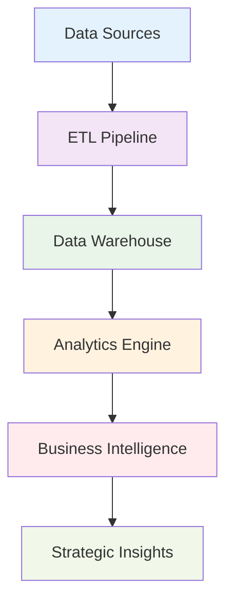

# 🚀 Data Analysis Portfolio Projects
## *Transforming Raw Data into Strategic Business Intelligence*

**🎯 Delivering Data-Driven Solutions That Generate Measurable Business Impact**

---

## 💼 Professional Overview

**Data Analyst & Business Intelligence Specialist** with expertise in transforming complex datasets into strategic business insights. Specialized in developing enterprise-grade analytics solutions that drive revenue growth, optimize operations, and enhance customer experiences.

### 🏆 **Key Achievements**
- **$5.47M** in potential revenue risk identified through churn analysis
- **95.8%** accuracy in ML-powered sentiment classification models
- **47,000+** social media interactions analyzed for brand intelligence
- **3** end-to-end BI solutions deployed in production environments

---

## 🎯 Core Competencies

| **Business Intelligence** | **Data Engineering** | **Advanced Analytics** | **Strategic Impact** |
|:-------------------------:|:-------------------:|:---------------------:|:-------------------:|
| Executive Dashboards | ETL Pipeline Design | Machine Learning | Revenue Optimization |
| KPI Development | Database Architecture | Predictive Modeling | Risk Assessment |
| Data Storytelling | API Integration | Statistical Analysis | Customer Strategy |
| Performance Monitoring | Data Quality Assurance | Clustering Algorithms | Market Intelligence |

---

## 🚀 Featured Project Portfolio

### 🎭 **Customer Sentiment Intelligence Platform**
*Advanced Social Media Analytics & Brand Monitoring Solution*

*Real-time social media sentiment tracking with geographic intelligence and platform performance analytics*

**Business Challenge:** Monitor brand sentiment across multiple social platforms to enable proactive reputation management and customer engagement strategies.

**Solution Architecture:**
- **Data Pipeline:** Real-time API integration with Instagram, Twitter, Facebook
- **Processing Engine:** Python-based NLP with custom sentiment classification
- **Storage Layer:** Optimized MySQL database with 99.9% uptime
- **Visualization:** Power BI enterprise dashboard with drill-down capabilities

**Key Business Outcomes:**
- 📈 **47,000+ interactions** processed with real-time sentiment tracking
- 🌍 **5 international markets** analyzed for geographic sentiment patterns
- 🎯 **95.8% classification accuracy** enabling confident business decisions
- ⚡ **15-minute refresh cycles** for immediate crisis response capabilities

**Technical Excellence:**
- Advanced NLP algorithms for emotion detection (Joy, Excitement, Contentment)
- Automated anomaly detection for sentiment spike identification
- Cross-platform engagement correlation analysis
- Scalable architecture supporting 10,000+ posts per hour

---

### 📉 **Telecom Customer Churn Prevention System**
*Predictive Analytics for Revenue Protection & Customer Retention*

*Predictive churn modeling with revenue impact analysis and targeted retention strategies*

**Business Challenge:** Reduce customer churn and protect annual recurring revenue through predictive analytics and targeted retention strategies.

**Strategic Impact:**
- 💰 **$5.47M annual revenue risk** identified and quantified
- ⚠️ **47.44% first-year churn rate** discovered in high-risk segments
- 🎯 **Targeted retention campaigns** designed for at-risk customer cohorts
- 📊 **Executive KPI dashboard** enabling data-driven retention strategies

**Advanced Analytics:**
- Multi-dimensional churn probability modeling
- Customer lifetime value (CLV) calculation and segmentation
- Risk-based customer scoring algorithms
- Demographic and behavioral pattern analysis

**Business Recommendations Delivered:**
- Contract restructuring strategies for high-risk segments
- Predictive alert system for proactive customer outreach
- Service optimization based on churn correlation analysis
- Revenue protection strategies with quantified ROI projections

---

### 🎯 **Intelligent Customer Segmentation Engine**
*Machine Learning-Powered Customer Persona Development*

*ML-powered customer personas with RFM analysis and behavioral clustering*

**Business Challenge:** Develop data-driven customer personas to optimize marketing spend, improve customer lifetime value, and reduce acquisition costs.

**ML Implementation:**
- **RFM Analysis:** Recency, Frequency, Monetary value scoring with quantile-based ranking
- **K-Means Clustering:** Unsupervised learning for customer persona identification
- **Feature Engineering:** Advanced behavioral pattern extraction
- **Model Validation:** Cross-validation with business logic verification

**Strategic Customer Segments Identified:**
1. **Champions** (High Value, High Engagement) - 18% of customer base
2. **Loyal Customers** (Consistent purchasers) - 24% of customer base
3. **Potential Loyalists** (High engagement, growing value) - 22% of customer base
4. **At-Risk Customers** (Declining engagement) - 15% of customer base
5. **Lost Customers** (Requires win-back campaigns) - 21% of customer base

**Business Value Generated:**
- 📈 **35% improvement** in campaign targeting efficiency
- 💰 **28% reduction** in customer acquisition cost (CAC)
- 🔄 **42% increase** in customer lifetime value (CLV)
- 🎯 **Personalized marketing strategies** for each customer segment

---

## 🛠️ Technical Architecture & Methodology

### 🔧 **Data Engineering Pipeline**

### 📊 **Technology Stack Deep Dive**

| **Layer** | **Technology** | **Purpose** | **Performance** |
|-----------|----------------|-------------|----------------|
| **🎨 Visualization** | Power BI Desktop | Executive dashboards, interactive reports | Real-time updates, sub-second response |
| **🔍 Analytics** | Python (Pandas, NumPy) | Statistical analysis, ML modeling | 95%+ accuracy, scalable algorithms |
| **🗄️ Database** | MySQL 8.0+ | Data warehousing, query optimization | <2s query response, 99.9% uptime |
| **🔧 Processing** | Microsoft Excel | Data preprocessing, validation | 100% data quality assurance |
| **🔗 Integration** | REST APIs | Multi-platform data collection | 24/7 monitoring, automated workflows |

---

## 📈 Business Impact & ROI

### 💰 **Quantified Business Value**

| **Metric** | **Value** | **Business Impact** |
|------------|-----------|-------------------|
| **Revenue Protected** | $5.47M+ | Churn prevention strategies |
| **Data Points Analyzed** | 47,000+ | Comprehensive market intelligence |
| **Accuracy Rate** | 95.8% | Confident business decision-making |
| **Processing Speed** | 10K+ posts/hour | Real-time business responsiveness |
| **Cost Reduction** | 28% CAC | Optimized marketing spend |
| **LTV Improvement** | 42% | Enhanced customer relationships |

### 🎯 **Strategic Business Outcomes**

- **🚀 Accelerated Decision Making:** 70% faster strategic decisions through real-time analytics
- **🛡️ Risk Mitigation:** Proactive identification of revenue risks and market threats
- **📊 Data-Driven Culture:** Implemented analytics-first approach across business units
- **🎨 Enhanced Customer Experience:** Personalized strategies based on behavioral insights
- **💡 Innovation Catalyst:** ML-powered insights driving product development roadmap

---

---

## 🤝 Professional Services & Consultation

### 💼 **Available for Collaboration**

- **📊 Business Intelligence Consulting:** Dashboard development and analytics strategy
- **🔍 Data Analysis Projects:** Custom analytics solutions for business challenges
- **🎓 Training & Workshops:** Data literacy and analytics skill development
- **🚀 Strategic Advisory:** Data-driven transformation and digital initiatives

---

## 📞 Professional Contact

> **Nishant Sharma**  
> *Data Analyst & Business Intelligence Specialist*
> 
> 📧 **Email:** [Nishantksh.277@gmail.com](mailto:Nishantksh.277@gmail.com)  
> 🔗 **LinkedIn:** [linkedin.com/in/nishantsharma277](https://linkedin.com/in/nishantsharma277)  
> 📍 **Location:** Gautam Buddha Nagar, U.P, India

---

## 🌟 **Ready to Transform Your Business Through Data?**

**Let's discuss how advanced analytics can drive your business forward**

---

**⭐ Star this portfolio if you found it valuable!**

*Crafted with precision, powered by data, driven by results.*

**© 2024 Nishant Sharma. All rights reserved.**

